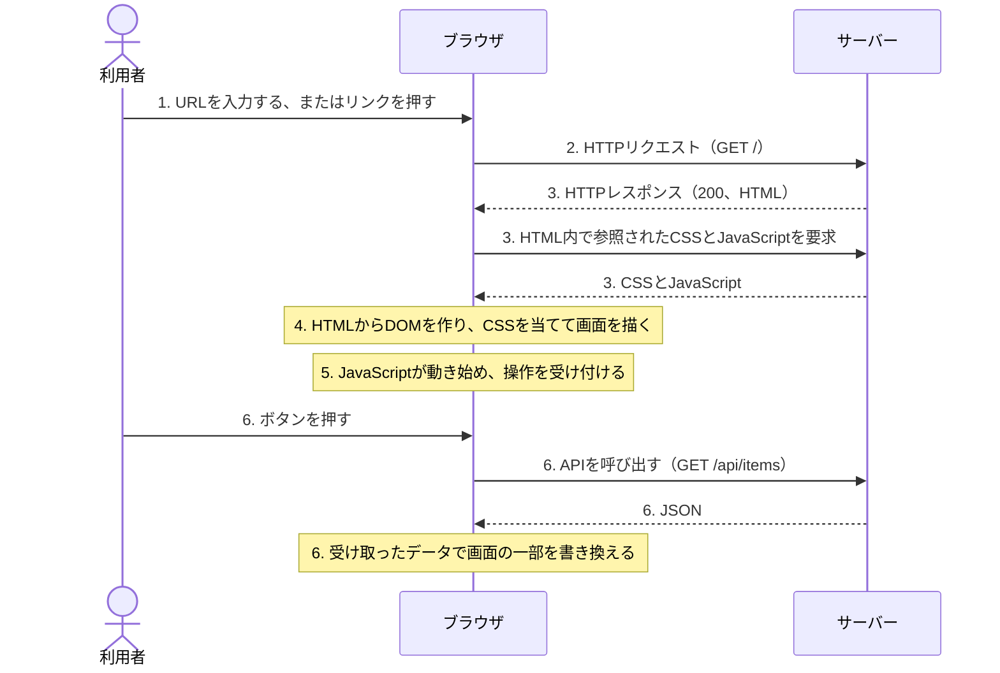
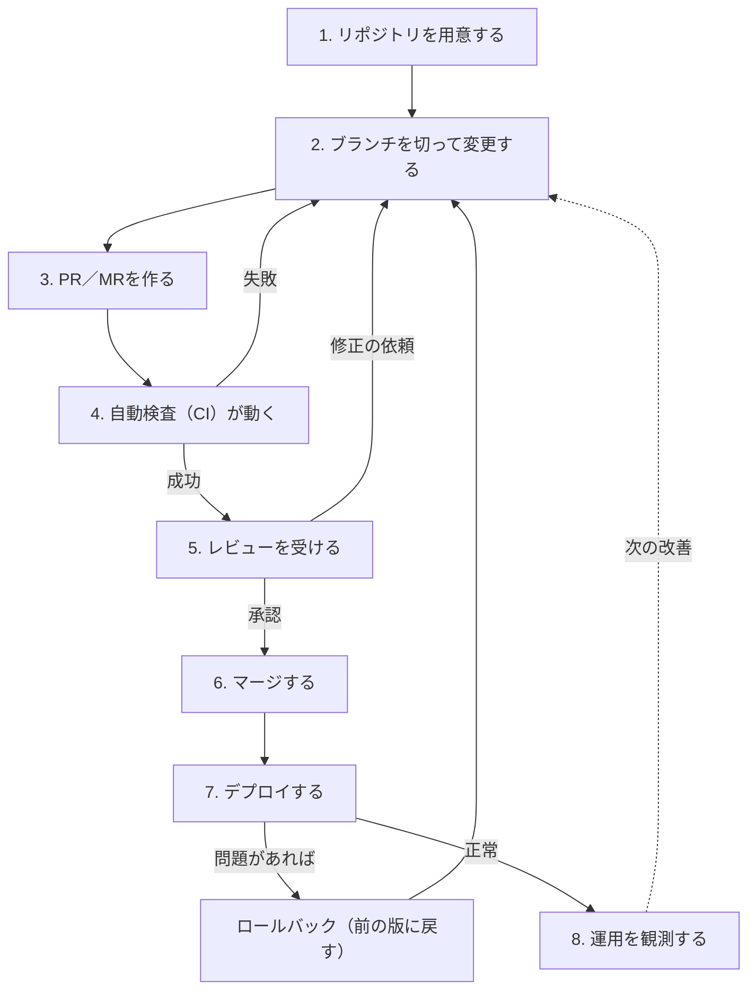

# フロントエンド開発の前提知識

本書の要素技術とチームチェックリストは、フロントエンド開発の基本的な用語と作業の流れを前提に書かれています。このページは、フロントエンド開発に不慣れな方が本書を読み始めるために必要な前提を、四つのまとまりで説明します。個々の用語は[用語集](glossary.md)で確認できます。

## フロントエンドとは何か

Webアプリケーションは、利用者の手元で動く部分と、遠くのコンピューターで動く部分に分かれます。

| 区分 | 動く場所 | 担うこと | 本書での扱い |
| :--- | :--- | :--- | :--- |
| フロントエンド | 利用者のブラウザ | 画面の表示、操作の受け付け、入力の検証、サーバーとの通信 | 28の要素技術の対象 |
| バックエンド | サーバー | データの保存と処理、認証と認可、APIの提供 | チームチェックリストでは連携先として扱う |

フロントエンドの開発者は、ブラウザという実行環境の性質を理解した上で、利用者が見て操作する画面を作ります。同じ画面でも、通信の遅さ、画面の大きさ、キーボードや音声での操作など、利用者ごとに異なる条件で動く必要があります。品質やアクセシビリティ、性能の項目が本書に多いのは、この条件の多様さが理由です。

## 画面が表示されるまで

利用者がURLを開いてから画面を操作するまで、ブラウザとサーバーは次の順で動きます。

| 順 | 起きること | 関係する用語 |
| :---: | :--- | :--- |
| 1 | 利用者がブラウザにURLを入力するか、リンクを押します。 | URL |
| 2 | ブラウザがサーバーへ要求（リクエスト）を送ります。 | HTTP、リクエストとレスポンス |
| 3 | サーバーが応答（レスポンス）として、HTML、CSS、JavaScriptなどを返します。結果はステータスコードで示されます。 | ステータスコード、キャッシュ |
| 4 | ブラウザがHTMLから要素の木構造（DOM）を作り、CSSを当てて画面を描きます。 | HTML、CSS、DOM、レンダリング |
| 5 | JavaScriptが動き始め、ボタンや入力欄などの操作を受け付けられるようになります。 | JavaScript、イベント |
| 6 | 利用者の操作に応じて、JavaScriptがAPIを呼び出してデータを取得・更新し、画面の一部を書き換えます。 | API、非同期処理、状態管理 |

同じ流れを、利用者、ブラウザ、サーバーの間のやり取りとして示します。実線の矢印が要求、破線の矢印が応答です。図の番号は、上の表の「順」に対応します。

3までが通信、4と5が描画、6以降が画面上の動作です。表示が遅い、表示が崩れる、操作しても反応しないという不具合は、どの段階で起きているかを切り分けると原因に近づけます。ブラウザの開発者ツールは、この各段階を確認するための道具です。

## HTML・CSS・JavaScriptの役割

フロントエンドの中核は、役割の異なる三つの言語です。

| 言語 | 役割 | 例 |
| :--- | :--- | :--- |
| HTML | 内容と構造を記述します。何が見出しで、何がボタンかを表します。 | `<button>送信</button>` |
| CSS | 見た目を指定します。色、文字、余白、配置を決めます。 | `button { color: white; }` |
| JavaScript | 動きを付けます。操作への反応、通信、画面の更新を行います。 | ボタンを押したらデータを送信する |

実際の開発では、この三つをそのまま書くだけでなく、次の道具を重ねて使います。

- **TypeScript** は、JavaScriptに型（値の種類の宣言）を加えた言語です。実行前に誤りを見つけやすくなります。ブラウザはTypeScriptを直接動かせないため、ビルドという処理でJavaScriptに変換します。
- **React** などのUIライブラリは、画面をコンポーネント（再利用できる部品）の組み合わせとして記述する仕組みです。データが変わると画面の該当部分を自動で更新します。
- **フレームワーク**（Next.jsなど）は、ページの構成、通信、ビルドの方法まで含めた土台です。

本書の[要素技術](../skills/index.md)は、この積み重なりに沿って四つの領域に分かれています。基礎領域がHTML・CSS・JavaScriptとWebの仕組み、応用基礎領域がその発展、フレームワーク・実装領域がReactなどを使った実装、品質・高度化領域がテストや性能、セキュリティです。

## チーム開発の流れ

一人で書いたコードを、チームで安全に公開するまでには決まった流れがあります。チームチェックリストの多くの項目は、この流れのどこかを対象にしています。

| 順 | 作業 | 内容 | 関係する用語 |
| :---: | :--- | :--- | :--- |
| 1 | リポジトリを用意する | ソースコードと変更履歴を、GitHubやGitLabなどの共有の置き場所に保管します。 | リポジトリ、Git |
| 2 | ブランチを切って変更する | 本流に影響を与えない作業用の分岐を作り、変更をコミットとして記録します。 | ブランチ、コミット |
| 3 | PR／MRを作る | 変更を本流へ取り込んでほしいと依頼します。変更の目的と内容を説明します。 | Pull RequestとMerge Request |
| 4 | 自動検査（CI）が動く | Lint、型検査、テスト、ビルドが自動で実行されます。失敗するとマージできません。 | CI、Lint、型検査、テスト |
| 5 | レビューを受ける | 他の開発者が変更を読み、誤りや設計を確認して指摘します。 | コードレビュー |
| 6 | マージする | 検査とレビューを通った変更を本流に統合します。 | マージ |
| 7 | デプロイする | 本流のコードをビルドし、ステージングや本番の環境へ配置します。問題があればロールバックします。 | デプロイとCD、環境、ロールバック |
| 8 | 運用を観測する | 本番での性能、エラー、利用状況を観測し、次の改善につなげます。 | モニタリングとオブザーバビリティ、インシデント |

同じ流れを図にすると次のようになります。番号は上の表の「順」に対応します。自動検査やレビューで問題が見つかると2に戻って修正し、デプロイ後に問題が起きればロールバックして前の版に戻します。

本書とチェック項目の原文にあるPRはPull Requestを指します。GitLabを使用する場合は、MR（Merge Request）と読み替えてください。

## 次に読む

- 分からない用語が出てきたら、[用語集](glossary.md)を開いてください。各要素技術ページと各小テーマページの冒頭にも、そのページで前提とする用語への案内があります。
- 学習を始めるなら、[基礎領域](../skills/foundation/index.md)の5つの要素技術から読み、各ページの参考リンクにあるMDNやweb.devの入門コースへ進んでください。本書は評価の基準を示す文書であり、学習の教材そのものは参考リンク先に委ねています。
- 評価の進め方を知るには、[ガイドの目的と評価の全体像](overview.md)から順に読んでください。
